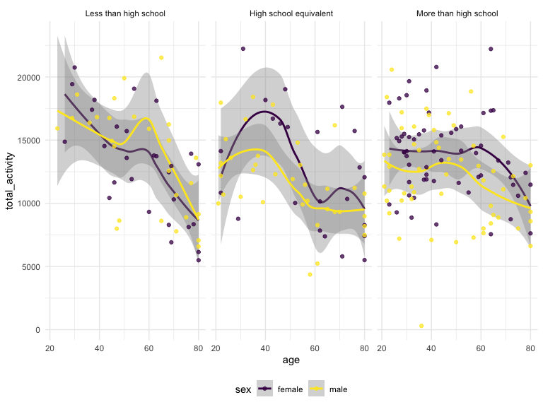

p8105_hw3_tl3195
================
Tingyi Li
2023-10-13

# Problem 1 (Instacart)

Read in the dataset:

``` r
data("instacart")
instacart=instacart
```

Description of dataset: This dataset has 1384617 rows and 15 columns,
with each row resprenting a single product from an instacart order.
Variables include: `order_id`: order identifier `product_id`: product
identifier `add_to_cart_order`: the order in which each product was
added to the cart `reordered`: 1 if this prodcut has been ordered by
this user in the past, 0 otherwise `user_id`: customer identifier
`eval_set`: which evaluation set this order belongs in (Note that the
data for use in this class is exclusively from the “train” eval_set)
`order_number`: the order sequence number for this user (1=first, n=nth)
`order_dow`: the day of the week on which the order was placed
`order_hour_of_day`: the hour of the day on which the order was placed
`days_since_prior_order`: days since the last order, capped at 30, NA if
order_number=1 product_name: name of the product `aisle_id`: aisle
identifier `department_id`: department identifier `aisle`: the name of
the aisle `department`: the name of the department

The number of aisles and which aisles are the most items ordered from:

``` r
instacart |> 
  count(aisle) |> 
  arrange(desc(n))
```

    ## # A tibble: 134 × 2
    ##    aisle                              n
    ##    <chr>                          <int>
    ##  1 fresh vegetables              150609
    ##  2 fresh fruits                  150473
    ##  3 packaged vegetables fruits     78493
    ##  4 yogurt                         55240
    ##  5 packaged cheese                41699
    ##  6 water seltzer sparkling water  36617
    ##  7 milk                           32644
    ##  8 chips pretzels                 31269
    ##  9 soy lactosefree                26240
    ## 10 bread                          23635
    ## # ℹ 124 more rows

There are 134 aisles. The most item are ordered from fresh vegetables
aisles.

Make a plot that shows the number of items ordered in each aisle,
limiting this to aisles with more than 10000 items ordered

``` r
instacart |> 
  count(aisle) |> 
  filter(n > 10000) |> 
  mutate(aisle = fct_reorder(aisle, n)) |> 
  ggplot(aes(x = aisle, y = n)) + 
  geom_point() + 
  labs(title = "Number of items ordered in each aisle") +
  theme(axis.text.x = element_text(angle = 60, hjust = 1))
```


Make a table showing the three most popular items in each of the aisles
“baking ingredients”, “dog food care”, and “packaged vegetables fruits”.
Include the number of times each item is ordered in your table.

``` r
instacart |>
  filter(aisle %in% c("baking ingredients", "dog food care", "packaged vegetables fruits")) |>
  group_by(aisle) |>
  count(product_name) |> 
  mutate(rank = min_rank(desc(n))) |> 
  filter(rank < 4) |> 
  arrange(desc(n)) |>
  knitr::kable()  
```

| aisle                      | product_name                                  |    n | rank |
|:---------------------------|:----------------------------------------------|-----:|-----:|
| packaged vegetables fruits | Organic Baby Spinach                          | 9784 |    1 |
| packaged vegetables fruits | Organic Raspberries                           | 5546 |    2 |
| packaged vegetables fruits | Organic Blueberries                           | 4966 |    3 |
| baking ingredients         | Light Brown Sugar                             |  499 |    1 |
| baking ingredients         | Pure Baking Soda                              |  387 |    2 |
| baking ingredients         | Cane Sugar                                    |  336 |    3 |
| dog food care              | Snack Sticks Chicken & Rice Recipe Dog Treats |   30 |    1 |
| dog food care              | Organix Chicken & Brown Rice Recipe           |   28 |    2 |
| dog food care              | Small Dog Biscuits                            |   26 |    3 |

Make a table showing the mean hour of the day at which Pink Lady Apples
and Coffee Ice Cream are ordered on each day of the week.

``` r
instacart |>
  filter(product_name %in% c("Pink Lady Apples", "Coffee Ice Cream")) |>
  group_by(product_name, order_dow) |>
  summarize(mean_hour = mean(order_hour_of_day)) |>
  pivot_wider(
    names_from = order_dow, 
    values_from = mean_hour) |>
  knitr::kable(digits = 2)
```

    ## `summarise()` has grouped output by 'product_name'. You can override using the
    ## `.groups` argument.

| product_name     |     0 |     1 |     2 |     3 |     4 |     5 |     6 |
|:-----------------|------:|------:|------:|------:|------:|------:|------:|
| Coffee Ice Cream | 13.77 | 14.32 | 15.38 | 15.32 | 15.22 | 12.26 | 13.83 |
| Pink Lady Apples | 13.44 | 11.36 | 11.70 | 14.25 | 11.55 | 12.78 | 11.94 |

# Problem 2 (BRFSS)

Load the data data from the p8105.datasets package using:

``` r
data("brfss_smart2010")
brfss=brfss_smart2010
```

Data cleaning:

format the data to use appropriate variable names; focus on the “Overall
Health” topic include only responses from “Excellent” to “Poor” organize
responses as a factor taking levels ordered from “Poor” to “Excellent”

Specify response column (show all the values):

``` r
brfss=brfss |>
  janitor::clean_names() |>
  mutate(data_value=as.double(data_value))
unique(brfss$response)
```

    ##  [1] "Excellent"                                 
    ##  [2] "Very good"                                 
    ##  [3] "Good"                                      
    ##  [4] "Fair"                                      
    ##  [5] "Poor"                                      
    ##  [6] "Good or Better Health"                     
    ##  [7] "Fair or Poor Health"                       
    ##  [8] "Yes"                                       
    ##  [9] "No"                                        
    ## [10] "Yes, pregnancy-related"                    
    ## [11] "No, pre-diabetes or borderline diabetes"   
    ## [12] "Smoke everyday"                            
    ## [13] "Smoke some days"                           
    ## [14] "Former smoker"                             
    ## [15] "Never smoked"                              
    ## [16] "Neither overweight nor obese (BMI le 24.9)"
    ## [17] "Overweight (BMI 25.0-29.9)"                
    ## [18] "Obese (BMI 30.0 - 99.8)"                   
    ## [19] "Checked in past 5 years"                   
    ## [20] "Not Checked in past 5 years"               
    ## [21] "Never Checked"                             
    ## [22] "Consume 5 or more times per day"           
    ## [23] "Consume less than 5 times per day"

The responses include “Excellent”, “Very Good”, “Good”, “Fair”, and
“Poor”.

Organize responses as a factor taking levels ordered from “Poor” to
“Excellent”:

``` r
brfss=brfss|>
  filter(topic=="Overall Health",response %in% c("Poor", "Fair", "Good", "Very good", "Excellent"))|>
  mutate(
    response=factor(response, levels=c("Poor", "Fair", "Good", "Very good", "Excellent"))
  )
```

Therefore, the order now is “Poor”, “Fair”, “Good”, “Very Good”, and
“Excellent”.

In 2002, states were observed at 7 or more locations

``` r
brfss |>
  filter(year==2002) |>
  group_by(locationabbr) |>
  summarize(n_stats = n_distinct(locationdesc)) |>
  filter(n_stats>=7)
```

    ## # A tibble: 6 × 2
    ##   locationabbr n_stats
    ##   <chr>          <int>
    ## 1 CT                 7
    ## 2 FL                 7
    ## 3 MA                 8
    ## 4 NC                 7
    ## 5 NJ                 8
    ## 6 PA                10

CT, FL, MA, NC, NJ, and PA are states observed at 7 or more locations in
2002.

In 2010, states were observed at 7 or more locations

``` r
brfss |>
  filter(year==2010) |>
  group_by(locationabbr) |>
  summarize(n_stats = n_distinct(locationdesc)) |>
  filter(n_stats>=7)
```

    ## # A tibble: 14 × 2
    ##    locationabbr n_stats
    ##    <chr>          <int>
    ##  1 CA                12
    ##  2 CO                 7
    ##  3 FL                41
    ##  4 MA                 9
    ##  5 MD                12
    ##  6 NC                12
    ##  7 NE                10
    ##  8 NJ                19
    ##  9 NY                 9
    ## 10 OH                 8
    ## 11 PA                 7
    ## 12 SC                 7
    ## 13 TX                16
    ## 14 WA                10

CA, CO, FL, MA, MD, NC, NE, NJ, NY, OH, PA, SC, TX, and WA are states
observed at 7 or more locations in 2010.

Construct a dataset that is limited to Excellent responses, and
contains, year, state, and a variable that averages the data_value
across locations within a state.

``` r
dataone = brfss |>
  filter(response=="Excellent") |>
  group_by(year, locationabbr) |>
  summarize(data_value_mean=mean(data_value, na.rm = TRUE))
```

    ## `summarise()` has grouped output by 'year'. You can override using the
    ## `.groups` argument.

Make a “spaghetti” plot of this average value over time within a state:

``` r
dataone |>
  rename("state"="locationabbr") |>
  ggplot(aes(x=year, y=data_value_mean, color=state)) +
  geom_point() + geom_line() +
  theme(legend.position = "bottom")
```


The average data_value in excellent responses is between year of 2002 to
year of 2010. For most of the states, the range of the average
data_value for excellent responses is approximately between 17 and 28.

Make a two-panel plot showing, for the years 2006, and 2010,
distribution of data_value for responses (“Poor” to “Excellent”) among
locations in NY State.

``` r
two_panel=
  brfss |>
  filter(locationabbr=="NY"& year %in% c(2006,2010))|>
  ggplot(aes(x =response , y = data_value)) + 
  geom_boxplot()+
  labs(title = "Distribution of data_value in NY State in 2006 and 2010") +
  facet_grid(.~year)

two_panel
```


In both 2006 and 2010 distributions, the “Poor” responses have lowest
median value. Generally, the value of “Excellent” responses, “Very Good”
responses and “Good” resposnes have higher data values than “Poor” and
“Fair” responses in both 2006 and 2010. The “Very Good” responses in
2010 have larger variation and higher median value compared to those in
2006. The “Good” responses in 2010 have smaller variation lower median
compare to those in 2006. The “Fair” responses in 2010 have larger
variations compared to those in 2006.

# Problem 3 (Accelerometers)

Import dataset

``` r
demographic = read_csv("./nhanes_covar.csv", skip=4) |>
  janitor::clean_names()
```

    ## Rows: 250 Columns: 5
    ## ── Column specification ────────────────────────────────────────────────────────
    ## Delimiter: ","
    ## dbl (5): SEQN, sex, age, BMI, education
    ## 
    ## ℹ Use `spec()` to retrieve the full column specification for this data.
    ## ℹ Specify the column types or set `show_col_types = FALSE` to quiet this message.

``` r
accelerometer=read_csv("./nhanes_accel.csv") |>
  janitor::clean_names()
```

    ## Rows: 250 Columns: 1441
    ## ── Column specification ────────────────────────────────────────────────────────
    ## Delimiter: ","
    ## dbl (1441): SEQN, min1, min2, min3, min4, min5, min6, min7, min8, min9, min1...
    ## 
    ## ℹ Use `spec()` to retrieve the full column specification for this data.
    ## ℹ Specify the column types or set `show_col_types = FALSE` to quiet this message.

Clean the demograhic data:

Include all originally observed variables; Exclude participants less
than 21 years of age, and those with missing demographic data; Encode
data with reasonable variable classes (i.e. not numeric, and using
factors with the ordering of tables and plots in mind).

``` r
demographic=demographic|>
  drop_na()|>
  filter(age>=21)|>
  mutate(
     sex=case_match(
       sex,
       1~"male",
       2~"female"),
     education=case_match(
       education,
       1~"Less than high school",
       2~"High school equivalent",
       3~"More than high school"
     ),
     education=factor(education, levels=c(
       "Less than high school",
       "High school equivalent",
       "More than high school"))
  )
```

Clean accelerometer data:

``` r
accelerometer=accelerometer|>
  drop_na()|>
  pivot_longer(
    min1:min1440,
    names_to = "time",
    values_to = "mims_value"
  ) |>
  separate(time, into=c("min","minute"),3)|>
  select(-min)|>
  mutate(minute=as.integer(minute))
```

Merge the demographic data and accelerometer data:

``` r
demo_acce=
  inner_join(demographic, accelerometer, by="seqn")
```

Produce a reader-friendly table for the number of men and women in each
education category:

``` r
demo_acce|>
  group_by(sex,education)|>
  summarize(n_obs=n_distinct(seqn))|>
  pivot_wider(
    names_from=education,
    values_from=n_obs
  )|>
  knitr::kable()
```

    ## `summarise()` has grouped output by 'sex'. You can override using the `.groups`
    ## argument.

| sex    | Less than high school | High school equivalent | More than high school |
|:-------|----------------------:|-----------------------:|----------------------:|
| female |                    28 |                     23 |                    59 |
| male   |                    27 |                     35 |                    56 |

For both males and females, “More than high school” category has the
highest observations. Therefore, the education level of both males and
females are beyond high school. In “Less than high school” category, the
number of males and the number of females are approximately the same
(men is 27 and women is 28). In “High school equivalent” category, there
are more males (35) than females (23).

Create a visualization of the age distributions for men and women in
each education category:

``` r
demo_acce|>
  group_by(education,seqn)|>
  distinct(sex,age,education,seqn)|>
  ggplot(aes(x=age, fill=education)) +
  geom_density(alpha = .5) +
  labs(title="Age Distribution") +
  facet_grid(.~sex)
```


For both males and females, the age distribution of “More than high
school” category is right-skewed. For both males and females, the age
distribution of “less than high school” category is left-skewed. All
these indicate that young people tend to have higher education level.
There is a greater difference among age distribution in females than
that in males, which means that gender influences the education level
across age.

Create a total activity variable for each participant

``` r
tot_act=demo_acce|>
  group_by(sex,age,education,bmi,seqn)|>
  summarise(total_activity=sum(mims_value))
```

    ## `summarise()` has grouped output by 'sex', 'age', 'education', 'bmi'. You can
    ## override using the `.groups` argument.

Plot these total activities (y-axis) against age (x-axis);compare men to
women and have separate panels for each education level

``` r
tot_act|>
  ggplot(aes(x=age, y=total_activity, color=sex)) +
  geom_smooth() + geom_point(alpha=.75) +
  facet_grid(.~education)
```

    ## `geom_smooth()` using method = 'loess' and formula = 'y ~ x'



For “High School Equivalent” and “More than High School” categories, the
total activities for female is higher than the total activities for
males. Both females and males at young age have larger total activties
in all three education groups. For “More than High School” category,
both females and males have a smaller variation in age than other two
education groups.
